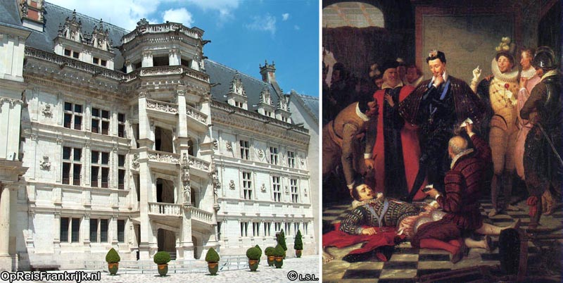
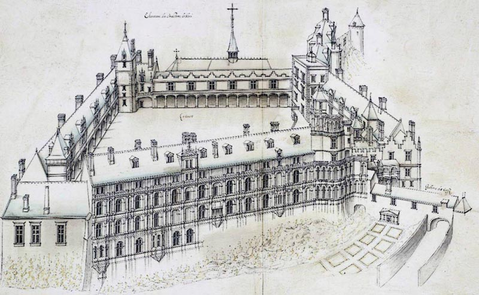
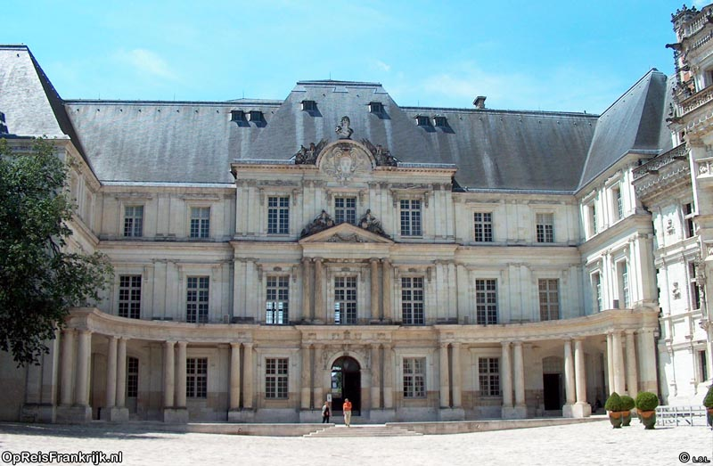

### Inleiding 
De geschiedenis van Blois komt tot leven in het kasteel en in het historische centrum. Het kasteel is in de 10de-eeuw gebouwd door de graven van Blois. In de daaropvolgende eeuwen vonden verbouwingen en uitbreidingen plaats door graven, troonopvolgers en koningen.  
Tot de oudste bebouwing in het historisch centrum behoort de Tour Beauvoir, een vierkante donjon uit de 11de-eeuw (bovenstaande foto; rechterkant). Deze toren is later opgenomen in de verdedigingswerken. In het centrum getuigen meerdere woningen van de 16de-eeuwse bloeiperiode. Deze welvaart vloeide voort uit de aanwezigheid van het de koninklijke hof.

### De graven van Blois

In de middeleeuwen werd Blois geregeerd door machtige leenheren, de graven van Blois. Hun graafschap betrof de streek waar Blois en Chartre deel van uitmaakte en de Champagne. Graaf Stefanus II van Blois trouwde met Adela van Normandië, een dochter van Willem de Veroveraar. Hun zoon Theobald IV regeerde Blois van 1102 tot 1152. Deze periode was de glansrijkste van Blois gedurende deze dynastie. Stefanus, broer van Theobald IV, werd in 1135 koning van Engeland.

### Blois wordt een koninklijke stad

Guy de Châtillon verkocht het graafschap van Blois in 1392 aan Lodewijk van Orléans, de broer van Karel VI. Blois werd vervolgens een belangrijke verblijfplaats van Lodewijk van Orléans, zijn vrouw Valentine Visconti en hun zijn zoon . Deze laatste wordt op 71-jarige leeftijd vader van de toekomstige Lodewijk XII (ruiterstandbeeld onder).

Onder Lodewijk XII, geboren en getogen in Blois, werd het [[Blois Kasteel|kasteel van Blois]] de belangrijkste koninklijke residentie. De koning en zijn vrouw Anna van Bretagne lieten hun residentie ingrijpend verbouwen. Lodewijk XII werd in 1515 opgevolgd door zijn schoonzoon en achterneef [[François I]] Laatstgenoemde liet aan het kasteel de naar hem genoemde vleugel bouwen (linksonder). Gedurende zijn regeerperiode hield hij vaak hof in het kasteel van Blois en Amboise. Aan het einde van zijn leven gaf hij echter de voorkeur aan Fontainebleau.

In 1588 dwong Henri de Guise koning Hendrik III (koning van 1551-1589) om de standenvergadering (een soort parlement) bijeen te roepen in het kasteel van Blois. Hendrik III voelde zich zo in het nauw gedwongen door deze aan populariteit toenemende rivaal liet vermoorden in het kasteel. Op het bovenstaande schilderij is de moord op Henri de Guise in opdracht van Hendrik III uitgebeeld. Het schilderij stamt uit de 1e helft van de 18de-eeuw, dus qua tijd is er een behoorlijke kloof die door fantasie is opgevuld. Hieronder zie je hoe het kasteel er rond 1575 uitzag (tekening van Androuet du Cerceau, filterbewerkingen toegepast omwille van duidelijkheid).  
In 1598 verplaatste Hendrik VI het hof naar Parijs. Daarmee werd de glansrijkste periode in de geschiedenis van Blois definitief afgesloten.

### Lodewijk XIII  

De verplaatsing van het machtscentrum naar Parijs had een enorme impact op Blois. (1610-1643) maakte handig gebruik van deze nieuwe situatie door dissidente familieleden naar het kasteel van Blois te verbannen. In 1617 deed hij dat met zijn moeder, Maria de’Medici. Aanleiding van het conflict vormde haar aanhoudende bemoeienis met staatszaken. La Medici installeerde een kleine hofhouding te Blois, maar ontsnapte uit het kasteel en verzoende zich later met haar zoon.  

In 1626 schonk Lodewijk XIII het graafschap van Blois aan zijn boer Gaston van Orléans. Tussen 1635 en 1638 liet Gaston van Orléans een vleugel bijbouwen aan het kasteel (bovenstaande foto). Gaston was tot zijn dood in 1660 vaak in het kasteel van Blois, soms onder koninklijke ban. Hij was namelijk voortdurend betrokken met intriges en moordcomplotten. Zijn moordplannen richtten zich hoofdzakelijk op Richelieu, de eerste minister van Lodewijk XIII. Richelieu perkte drastisch de invloed van vazallen en koninklijke familieleden in ten gunste van de koning.
