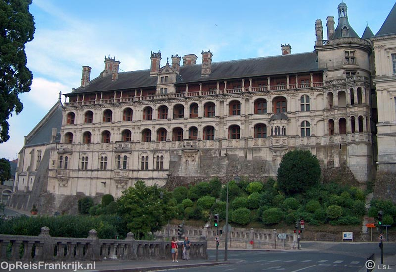
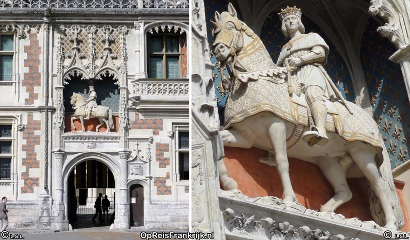
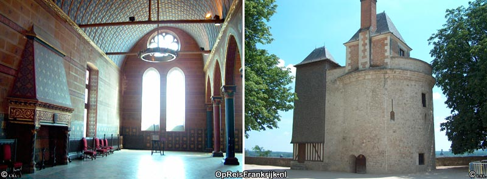
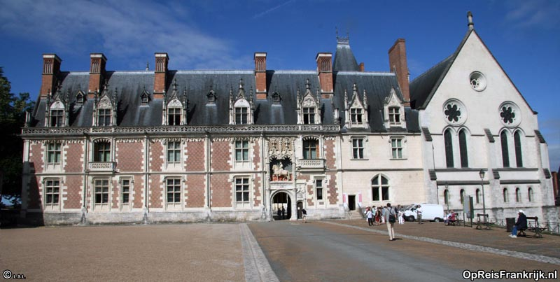

Het kasteel van Blois werd in de 10de eeuw opgericht. In de eerste instantie betrof het een versterkte vesting van de graven van Blois. Deze machtige leenheren breidden het kasteel uit gedurende generaties.

Op onderstaande foto zie je een ruiterstandbeeld van Lodewijk XII. Het staat in een nis van de voorgevel. In 1462 werd de toekomstige in dit kasteel geboren. Ook na zijn troonsbestijging bleef Blois zijn belangrijkste verblijfplaats. Tot diep in de 16de-eeuw behoorde de residentie tot de favoriete woonplaatsen van Franse vorsten.  
De eeuwenlange bewoning door fortuinlijke eigenaren had talrijke ingrijpende verbouwingen en uitbreidingen tot gevolg. Zo zijn er gedurende de eeuwen vleugels toegevoegd. De uitbreidingen zijn karakteristiek voor de desbetreffende [[Blois - Geschiedenis|bouwperioden]] met grote stijlgevolgen als gevolg.

### Het kasteel in de 13de en 14de eeuw

De oudste behouden zaal, de Salle des Etats Généraux, is rond 1220 gebouwd in opdracht van graaf Thibaut VI. Deze ruimte diende als ontvangstzaal en vergaderingsruimte voor de Standenvergadering. Het is de grootste 13de -eeuwse gotische zaal van Frankrijk (foto linksonder).

Van de oorspronkelijke vesting zijn verder de 13de-eeuwse entree en toren behouden. Rechts op bovenstaande foto staat de Tour du Foix, een onderdeel van de middeleeuwse vestingmuur. Het terras waarop dit verdedigingswerk is gelegen biedt een schitterend zicht op de omgeving.

### Lodewijk XII

(koning van 1498-1515)

In 1498, na de troonsbestijging van Lodewijk XII, werd het kasteel van Blois [[Blois Kasteel]] de belangrijkste verblijfplaats van het Franse hof. Op onderstaande foto is de voorgevel van het paleis te zien vanaf Place de Château met links de gevel van Lodewijk XII. De ramen zijn niet geordend volgens een op de symmetrie berustend systeem. Helemaal rechts zie je de buitenkant van de Salle des États généraux.

De Lodewijk XII-vleugel is tussen 1498 en 1503 gebouwd. De stijl is typerend voor de flamboyante gotiek, maar er zijn al enige renaissancistische elementen te bespeuren. Op de muren zijn het symbool (egel) en motto (dichtbij en veraf kan ik mezelf verdedigen) van Lodewijk XII afgebeeld.  Boven het portaal staat een ruiterstandbeeld van Lodewijk XII (een kopie). Een praktische vernieuwing was de galerij waarop de vertrekken uitkomen. Voorheen stonden de vertrekken alleen in verbinding met de aangrenzende ruimte.

Lodewijk XII liet ook Chapelle St.-Calais bouwen op de plaats van een voorganger. Van deze privékapel is alleen het koor behouden. Het schip werd in de 17de eeuw gesloopt om ruimte te maken voor nieuwbouw.

### **De Frans I vleugel (1515-1524) en meer**

Volgens velen is de Frans I vleugel, met haar wereldberoemde wenteltrap, de mooiste vleugel van het kasteel van Blois.
Gedurende de Franse vroege renaissance is de geleding van architectonische elementen nog niet onderworpen aan een strenge geometrische ordening. Wat dat betreft staat de Franse renaissance dichter bij de Flamboyante gotiek dan de Italiaanse renaissance. Dit is duidelijk te zien aan de schikking van de ramen aan het binnenhof (bovenstaande foto) en de arcaden van de façade de Loges (onderstaande foto). Laatgenoemde gevel bevindt zich aan de achterkant van deze vleugel. Bramante’s gevels met arcaden waren een belangrijke inspiratiebron. Bramante koos echter voor een heldere symmetrische geleding. In de Frans I vleugel is geen sprake van een consequente symmetrische ordening. Vroeger kwam deze zijde uit op door Lodewijk XII aangelegde tuinen.

De wenteltrap van de 16e-eeuwse Frans I-vleugel (binnenhof) behoort tot de hoogtepunten van de vroege Franse Renaissance. Deze trap zit in een achthoekig trappenhuis dat gedeeltelijk uit de gevel steekt. Het trappenhuis heeft balkons die uitzicht bieden op de binnenplaats. De hovelingen stonden daar tijdens festiviteiten en voor de ontvangst van belangrijke gasten. De trap loopt overigens veel steiler dan de balustrade suggereert. In de eerste instantie lag het trappenhuis middenin de Frans I vleugel. Een gedeelte van de vleugel is echter afgebroken tijdens de bouw van de Gaston-d’Orléans-vleugel.

Sommige zalen in deze vleugel hebben fraaie haarden. De meest fascinerende kamer is het kabinet van Catharina de’ Medeci. De muren bevatten achter panelen verstopte kastjes waarin o.a. staatsdocumenten, medicinale drankjes en juwelen werden bewaard. Door middel van een in de plint verborgen pedaal konden de kasten worden geopend

### De Gaston d’Orléans-vleugel

In de 17de-eeuw werd het kasteel bewoond door Gaston-d’Orléans, de broer van Koning Lodewijk XIII. De statige stijl is kenmerkend voor het classicisme van de zeventiende eeuw. Boven de statietrap bevinden zich twee achtereenvolgende koepels, die versierd zijn met allegorische beeldhouwwerken. Het aangezette perspectief is kenmerkend voor de barok.

### Musea

In het kasteel bevinden zich musea. In het museum voor Schone Kunsten zijn m.n. schilderijen en beeldhouwwerken te zien. De werken komen uit de zestiende tot en met de negentiende eeuw. Met name de portretten uit de 16e en de 17de-eeuw zijn interessant. De bekendste kunstenaars van wie er werk aanwezig is, zijn Ingres en Auguste Préault.

Enkele zalen zijn aan de geschiedenis van het gebouw gewijd en bevatten o.a. originele beeldhouwwerken en afgietsels. De uitgebeelde geestelijken op bovenstaande foto becommentarieerden mistanden. De Monnik links heeft duivelse gelaattrekken en een geldbuidel.
